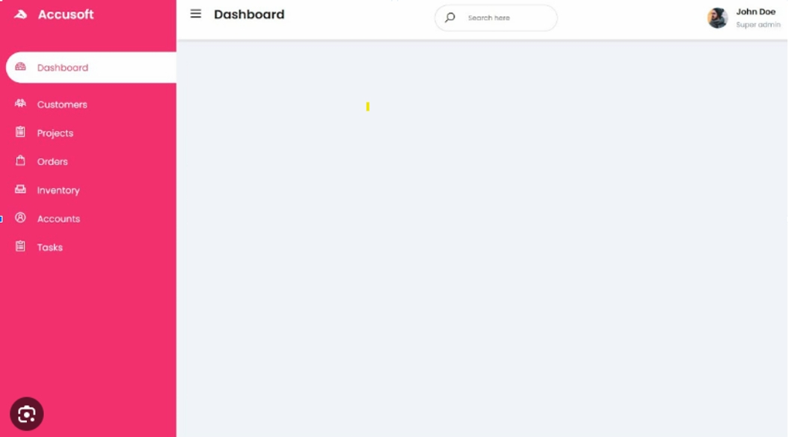

# Teste Técnico TechNation - Fullstack

## Descrição
Este projeto é um teste técnico desenvolvido, especialmente, para avaliar as suas habilidades como desenvolvedor fullstack. Para isso, você deve usar no frontend HTML, CSS, JS, jQuery, Bootstrap e biblioteca para criação de gráficos. E para o backend C# com a versão LTS mais recente do .Net e SQL Server (pode ser baixado nesse link).

Além disso, esperamos que você use uma tecnologia semelhante ao Razor para montar as páginas de frontend; ademais, você pode usar a arquitetura que quiser para organizar o seu sistema como um todo.

O objetivo é criar uma página web usando as tecnologias acima para demonstrar todas as suas habilidades como desenvolvedor.

Para isso, propomos a criação de uma tela do sistema financeiro de uma empresa com os dados das notas fiscais emitidas no ano passado (2023) e um dashboard. Essa ferramenta será utilizada pelo pessoal responsável pelo financeiro para manter o controle das notas e saber os principais indicadores.

### Requisitos
Para facilitar a operação do software pelos responsáveis do financeiro, a página deve conter as seguintes informações e funcionalidades:

-  **Dashboard com Indicadores:** indicadores com opções de filtro por mês, trimestre e ano. As seguintes informações devem ser mostradas no dashboard:
    - Valor total das notas emitidas;
    - Valor total das notas emitidas, mas sem ter a cobrança feita;
    - Valor total das notas vencidas - Inadimplência;
    - Valor total das notas a vencer;
    - Valor total das notas pagas;
    - Gráfico de evolução da inadimplência mês a mês;
    - Gráfico de evolução da receita recebida mês a mês;

-  **Lista de notas emitidas:** Parte da tela onde podemos ver e filtrar as notas fiscais presentes no sistema e aplicar filtros para encontrar as notas desejadas:
    - Informações necessárias:
        - Nome do pagador;
        - Número de identificação da nota;
        - Data de emissão da nota;
        - Data da cobrança;
        - Data do pagamento;
        - Valor da nota;
        - Documento da nota fiscal;
        - Documento do boleto bancário;
        - Status da nota;
            - Emitida;
            - Cobrança realizada;
            - Pagamento em atraso;
            - Pagamento realizado;
    - Filtros necessários:
        - Filtrar por mês de emissão da nota;
        - Filtrar pelo mês que a cobrança foi realizada;
        - Filtrar pelo mês que o pagamento foi realizado;
        - Filtrar pelo status da nota;

-  **Estrutura onde a tela deve ficar:** A estrutura da tela onde a página deve ficar deve ser semelhante a que é apresentada na figura abaixo. Deve conter um sidebar com um menu de navegação simples e um navbar com o nome da página e uma identificação para o usuário. Use o exemplo abaixo como base para montar a página.

A maneira como os dados serão mostrados na tela deve ser decidido por você durante a montagem da página. Além disso, não é permitido usar códigos externos além dos previamente listados na descrição do desafio. Contudo, você pode usar os elementos disponibilizados pelo Bootstrap para montar sua página.

Para o backend, a expectativa é que tenhamos uma rota para acessar a página esperada e todos os dados mostrados na tela tenham sido salvos em um banco de dados e acessados via código. Para isso esperamos que você entregue:
- **Rota para acessar a página com o dashboard:** O seu web server deve ter uma rota que leva para a página com o dashboard;
- **SQL das Tabelas Criadas:** Queremos que envie o SQL das tabelas criadas em conjunto com o software.

A expectativa é que o código tanto do backend quanto do frontend tenham um design que permita fácil manutenção e expansibilidade.

### Instruções para envio e entrega
O projeto deverá ser entregue via e-mail, contendo os dados do candidato, assim como o código do projeto confeccionado. Os arquivos a serem enviados devem estar em um repositório público do github. Além disso, é um requisito obrigatório usar o docker para montar o sistema final. E também recomenda-se que façam um arquivo README com os dados do desenvolvedor, versões das ferramentas utilizadas e instruções básicas para fazer o uso setup e uso do sistema. 

### Critérios de Avaliação
No processo de avaliação, iremos considerar o cumprimento dos requisitos descritos acima, o uso de conceitos de design tais como espaçamento, hierarquia visual e organização das informações na tela. Também iremos avaliar a escrita de um código limpo e a adoção de boas práticas de desenvolvimento, visando a manutenibilidade do sistema. Além disso, não vamos levar em consideração a estilização das telas, mas sim a usabilidade da mesma.

Quanto à organização do backend, vamos levar em conta se o código apresenta uma boa prática de código e organização. Além disso, que ele tenha sido feito de um jeito que seja fácil tanto fazer manutenção do código quanto expansão.

Este projeto é uma oportunidade para demonstrar suas habilidades como desenvolvedor Fullstack, mostrando sua capacidade de criar uma página onde você demonstra os seus fundamentos em frontend e backend e as suas habilidades em criação de páginas web com HTML, CSS e JS e C#.